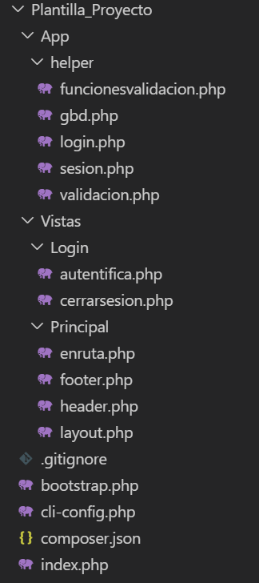

<div style="text-align:justify">

# Empecemos a utilizar Doctrine

Para seguir con la filosofía del curso he creado un direcrorio llamado **Plantilla_Proyecto**, cuyo árbol de directorios es el siguiente:



 y un script ejecutable llamado **crearproyecto.sh**. Este scrip recibe un parámetro que será el nombre de la carpeta donde crearemos el proyecto. Así, los pasos que vamos a seguir para crear la aplicación son:

1.Ejecutamos la siguiente línea para crear el esqueleto del proyecto.

```shell
bash crearproyecto.sh Inventario
```

2.Nos cambiamos a la carpeta Inventario y ejecutamos composer install.

```shell
cd Inventario
composer install
```

este comando nos instalará doctrine, ya que en el archivo composer.json existe un require para doctrine.

3.Ahora configuramos nuestra conexión a la base de datos en el fichero bootstrap.php. Por defecto viene configurado para mi base de datos Inventario.

4.Creamos las entidades de nuestra base de datos, es decir, a partir del esquema, Doctrine genera las clases necesarias. Estas, segun nuestra configuración las creamos en App\Entidades. Para ello ejecutamos los siguientes comandos de Doctrine:

```shell
php vendor/doctrine/orm/bin/doctrine orm:convert-mapping -f --from-database annotation --namespace="App\\Entidades\\" ./

php vendor/doctrine/orm/bin/doctrine orm:generate-entities . --generate-annotations=true --regenerate-entities
```

El primero genera las entidades y el segundo los getters y setters de las mismas.

Ha llegado la hora de escribir algún código.

## Trabajando con objetos

<https://www.doctrine-project.org/projects/doctrine-orm/en/2.6/reference/working-with-objects.html>

En Doctrine no se puede utilizar la sentencia **insert** de SQL para crear nuevas filas en nuestra Base de Datos. Ello permitiría romper la integridad de nuestro esquema de clases y colecciones de datos. Por tanto la persistencia de datos se consigue a traves de nuestro objeto doctrine, para nuestra configuración, **$entityManager**. He aquí un ejemplo:

```php
$nuevoArticulo=new Articulo();
$nuevoArticulo->setDescripcion("Impresora HP laser");
$nuevoArticulo->setFechaalta(new \DateTime());
$nuevoArticulo->setNumeroejemplares(2);
$nuevoArticulo->setInventariable(true);
$nuevaCategoria=new Categoria();
$nuevaCategoria->setDescripcion("Impresoras Laser");
$entityManager->persist($nuevaCategoria);
$nuevoArticulo->setCategoriaIdcategoria($nuevaCategoria);
$entityManager->persist($nuevoArticulo);
$entityManager->flush();
```

En este ejemplo creamos un nuevo objeto Articulo y una nueva Categoria. Despues se actualizan las colecciones de objetos de artículos y categorías con el método **persist**. Por último, si queremos guardar los datos en la Base de Datos llamamos al método **flush**.

Ahora vamos a borrar una entidad Articulo con valor de clave primaria 35:

```php
$articuloAborrar=$entityManager->find("Articulo",35);
$entityManager->remove($articuloAborrar);
$entityManager->flush();
```

### Buscar colecciones y modificar objetos

Para acceder a las colecciones de objetos Doctrine dispone de **repositorios** y estos implementan un conjunto de métodos de busqueda **find methods**. En el siguiente ejemplo se busca un artículo cuya descripción sea *Impresora HP laser* (ojo, al no ser clave primaria podrian aparecer varios artículos), y se le asigna la categoría con clave primaria 5.

```php
$articulo=$entityManager->getRepository("App\Entidades\Articulo")->findOneBy(["descripcion"=>"Impresora HP laser"]);
$categoria=$entityManager->getRepository("App\Entidades\Categoria")->find(5);
$articulo->setCategoriaIdcategoria($categoria);
$entityManager->flush();
```

fijémonos en el método *find*, en este caso pertenece a la clase Repository y no necesita el primer parámetro como si lo hace cuando es el *find* del objeto *$entityManager*.

## DQL Doctrine Query Languaje

<https://www.doctrine-project.org/projects/doctrine-orm/en/2.6/reference/dql-doctrine-query-language.html>

Doctrine dispone de su propio lenguaje de consulta, similar a SQL, pero realiza las consultas sobre las colecciones de entidades. En el enlace de arriba pueden ustedes consultar sus características, yo aquí os dejo algunos ejemplos:

### Listado de todos los artículos con nombre de categoría

```php
$consulta=$entityManager->createQuery("select a from App\Entidades\Articulo a");
$articulos=$consulta->getResult();
foreach ($articulos as $articulo) {
    echo "Descripción: ".$articulo->getDescripcion()."<br>";
    echo "Categoría: ".$articulo->getCategoriaIdcategoria()->getDescripcion()."<br>";
    echo "======================================================================<br>";
}
```

prestemos atención a la sentencia *$articulo->getCategoriaIdcategoria()->getDescripcion()*, el método get nos devuelve un objeto Categoria y por último cogemos la descripción de dicha categoría. Veamos la entidad Articulo:

```php
/**
     * @var \App\Entidades\Categoria
     *
     * @ORM\ManyToOne(targetEntity="App\Entidades\Categoria")
     * @ORM\JoinColumns({
     *   @ORM\JoinColumn(name="categoria_idcategoria", referencedColumnName="idcategoria")
     * })
     */
    private $categoriaIdcategoria;
```

### Artículos que no pertenecen a la categoría con id 5

```php
$consulta=$entityManager->createQuery("select a from App\Entidades\Articulo a join a.categoriaIdcategoria c where c.idcategoria!=5");
$articulos=$consulta->getResult();
var_dump($articulos);
```

fijense ustedes que el join se hace con el objeto categoría.

### Crear asociación bidireccional OneToMany

Doctrine no crea las asociaciones en ambas direcciones, así la relación, por ejemplo, que existe entre artículos y categorías solo se recoge en la entidad Articulo como hemos visto más arriba, es decir, desde una entidad artículo conocemos el objeto categoría al cual pertenece. Pero, un objeto categoría no conoce la colección de objetos artículo que posee. A modo de ejemplo os voy a crear esta asociación y un ejemplo para probarla.

En la entidad Categoria añadimos:

```php
    /**
     * @var \Doctrine\Common\Collections\Collection
     * @ORM\OneToMany(targetEntity="App\Entidades\Articulo", mappedBy="categoriaIdcategoria", cascade={"persist","remove"})
     */
    private $articulos;

    public function __construct()
    {
        $this->articulos= new ArrayCollection();
    }

    /**
     * Get the value of articulos
     *
     * @return  \Doctrine\Common\Collections\Collection
     */ 
    public function getArticulos()
    {
        return $this->articulos;
    }
```

y así nuestro código de consulta quedaría:

```php
$consulta=$entityManager->createQuery("select c from App\Entidades\Categoria c where c.idcategoria=5 ");
$articulos=$consulta->getResult();
foreach ($articulos[0]->getArticulos() as $articulo) {
    echo "Descripción :".$articulo->getDescripcion()."<br>";
}
```

Bien, este tutorial pretende introduciros en el mundo de Doctrine y DQL, será la práctica y la consulta de información la que os haga progresar en vuestro conocimiento. Antes de terminar deciros que existe una manera distinta de construir las consultas llamada QueryBuilder, aquí os dejo el enlace de la página oficial para que le echéis una ojeada.

<https://www.doctrine-project.org/projects/doctrine-orm/en/2.6/reference/query-builder.html#the-querybuilder>

Espero os haya servido esta lectura para despertar en vosotros el ansia de aprender Doctrine.